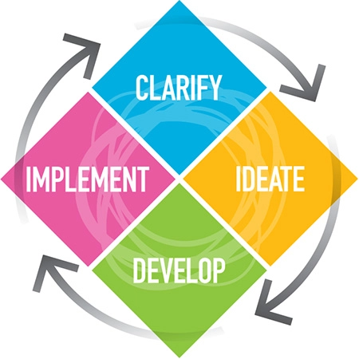

# Does Curiosity kill the cat?

Many companies are facing severe economy headwinds given the macro economic conditions. Companies strive for better results and better execution, no matter the economic conditions. But how do we get there? Business leaders across the country were asked the various factors which lead to better results and outcomes. While "innovation" was the clear winner, "inclusion" came second and "building a culture that values diversity" and "business results" tied for third. [^1] But for leaders who value all the above factors, "curiosity" might be the key that unlocks all those factors after all.

It is easy to say that one needs to be curious and highlight all the benefits. It is difficult to practice it. So I decided to research a little bit on how to enhance curiosity. I wanted to break it down into a process that could be ingrained in our busy schedule. I came across a model called "Creative Problem Solving" model or CPS. This model inherently makes 2 basic assumptions
1. *Everyone* is creative in one way or the other
2. Creativity is a skill that *needs to be learnt and crafted.*

Basically there are 2 main kinds of thinking that are needed to be creative
1. Divergent thinking

    Brainstorming is assumed to be the only phase of creative process. If you have a group of people put together to come up with a creative solution. A curious mind will generate a lot of ideas. Curiosity inherently does not have any boundaries. It is this divergence that allows us to go beyond obvious ideas and generate breakthrough ideas.

2. Convergent thinking

   Convergent thinking on the other hand helps the leaders to reign in the curious mind. It helps to harvest those breakthrough ideas into actionable items.

So when we as leaders and team players want to promote curiosity, we need to inherently promote *both* these thinking process. Creating safe space for divergent thinkers and marrying them with convergent thinkers lead to breakthrough innovations. These are only possible when we open our minds to the notion that "diversity and inclusion" promotes this.

    "..it is one thing to be curious, but another to be able to suspend your own beliefs. ...temporarily suspending your beliefs enables you to learn more and to engage, and often that is the key to overcoming barriers" - Hayden Majajas, diversity and inclusion director, Asia-Pacific BP

Creative Problem Solving Model [^2]

Without going into too much detail I am providing a framework which can be put to use along with brief pointers

- Clarify:
  - Explore the Vision

    Identify the goal. As leaders what are you trying to achieve. It could be filing patents, staging someone for promotion, saving costs for better bottom line of the company.

  - Gather Data

    Gather as much data as you can to corelate it to the current state of the vision. How many patents are you currently filing? What is the skills set of the people working under you? Where are we currently spending and why?

  - Formulate Challenges

    Now sharpen your focus by creating challenging questions that will invite creative solutions. This is the most crucial component.

- Ideate:
  - Explore Ideas
    Let your divergent brains run wild now. Expand the horizons to now stretch boundaries by answering the challenging questions you have formulated.

- Develop
  - Formulate Solutions
    This is where the convergent brains need to reign in the ideas. Harvesting and iterating the ideas. Here the leaders need to move the creative ideas to solutions.

- Implement
  - Formulate a plan
    Convert the solutions into actionable items. Identify the necessary resources that will support the implementation of those wild ideas.

CPS provides a good framework but it is the curious mind which needs to run wild to not only formulate the ideas but reining in the ideas to lead them to actionable conclusion.

Being inclusive and promoting curiosity is a process. It is a team sport. One is not possible without the other. Curiosity enriches individuals, it builds on diversity. Curiosity is a cornerstone of inclusion which often gets overlooked.

    "If you are not curious, you're not learning"  - Michael Dell

[^1]: The inclusion-curiosity connection by Julie Winkle Giulioni & Beverly Kaye

[^2]: https://www.creativeeducationfoundation.org/what-is-cps
